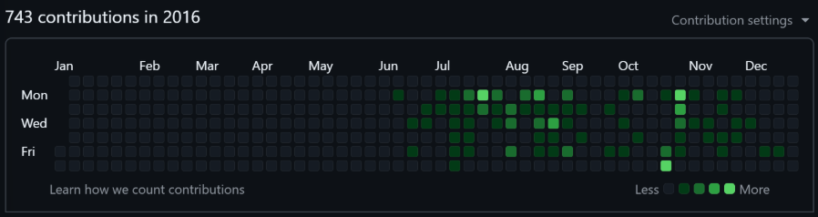
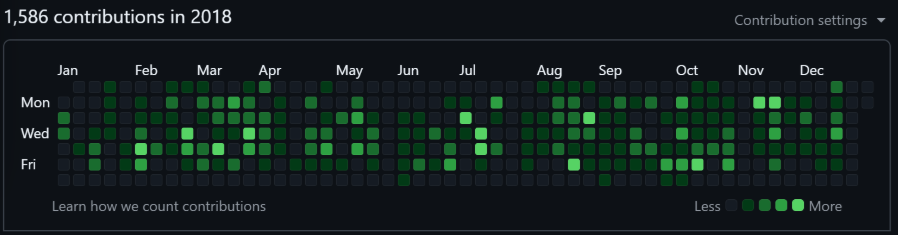
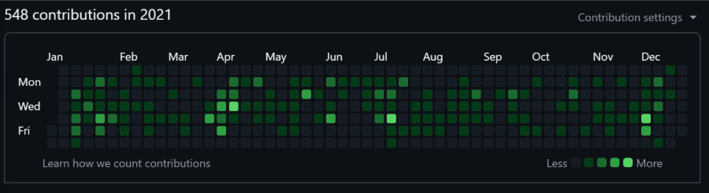
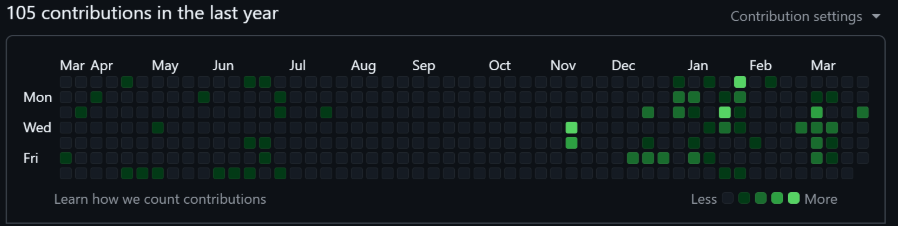
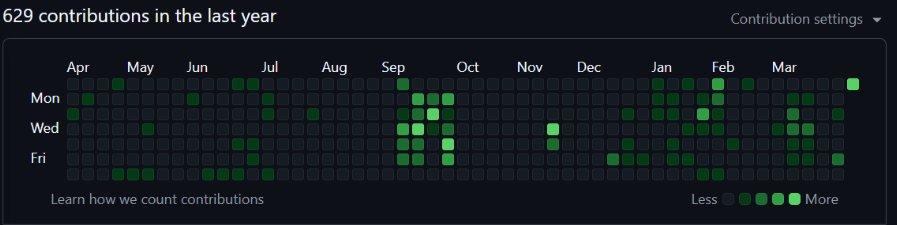

# Painting the Bathroom Tiles 🧼🛁

[](https://www.linkedin.com/in/timothybrookes) [](https://github.com/MrShiny608/bathroom_tile_machine/tree/master)

> A satirical dive into GitHub contribution graphs, developer vanity metrics, and what it really means to write good code.

## 💡 The Premise

GitHub’s contribution graph — those little green bathroom tiles — is often misunderstood as a measure of developer quality. More commits? Must be a better engineer! But that's completely devoid of context. How good are those commits? Are they just bugs? Are they thrown together unmaintainable code? Are they flip-flopping between design decisions?

So I built the **Bathroom Tile Machine** 🧱: a fake commit generator that turns your GitHub graph into an art project. It’s not fraud (unless you lie about it). It’s a satirical, educational tool to highlight why metrics without context are meaningless.

## ⚠️ Disclaimer

Just to be clear, I strongly recommend you do not use this tool to misrepresent yourself — it's morally wrong and potentially fraudulent. The purpose of this tool is to show how meaningless the graph is for measuring a "good" or "bad" engineer.

## 🤔 Why This Exists

I’ve heard too many times that a green graph means “productive.” It doesn’t.

- ✅ A commit could be a beautiful refactor — or a one-line bug disguised as progress.
- 🤹‍♂️ Good engineers think about the logic and performance of code they implement. Great ones think about maintainability, reliability, and long-term health of the system.
- 🧠 Large amounts of the best work an experienced developer does is not seen in commits — it's helping other developers grow, unblocking team members, architecting, designing, and aligning systems with business needs.

This tool is here to:

- 🪞 Challenge broken assumptions about developer performance
- 🔍 Reveal how shallow contribution metrics can be
- 🧬 Explore Git internals and metadata manipulation

## 🧵 Let's Talk Examples

### 🔥 Baptism of Fire

2016 is my first year using GitHub. My graph looks decent, right? Well, at this point I was jumping in the deep end developing systems I'd never developed before, using languages I'd never used before, and databases I'd never touched before.



So were these good commits? Hell no. I wrote an MVP in the first month, and then spent the next few weeks rewriting because, frankly, it was insane.

### ⚙️ Grindin' Microservices for EXP

So let's look two years later:



At this point I was a solo dev owning multiple microservices across a repo-per-service setup. I was on top of it all and developing features like mad — this and the following few years was probably some of the most productive I’ve ever been as an individual contributor. The graph looks a bit better than the first image, but the quality of my code here was well beyond what 2016-me could have imagined.

But is that all there is to being an engineer? Of course not — being productive alone isn’t the endgame. The real challenge (and reward) is enabling _others_ to be productive too.

### 🧑‍🏫 Principals of a Principal Developer



2021 looks like a reduction, right? Wrong. Sure, I'm committing less frequently, but I'm now a member of a team — mentoring other developers, aiding in design discussions, optimising struggling databases, pair programming, reviewing code, recording knowledge sharing presentations, and so much more.

Am I less productive? Maybe individually — all this "team" stuff takes time — but my personal impact? 💥 I'm having more impact here because I’m empowering those around me to have a larger impact.

### 🕵️ Stealth Mode

Finally, this last year — no longer Jan–Dec, but a great tale of three parts:



“Wow!”, you might say, “What a layabout!” 😬 Well, in the first third of the year I was on a project using Perforce, so yeah, GitHub doesn’t have a clue what I was up to. Those commits were me working on personal projects in the evenings and weekends.

“Okay sure, but what about the second third?”, you might say. At this point I was working so hard on the day job that I had nothing left to give in the evenings. Sometimes that happens, and that is completely okay. We’re human, and pretending we can work at 100% all the time is nonsense.

And the third part? Well that’s post-redundancy — me keeping on with personal projects while looking for work.

## 🛠️ How It Works

So what is this tool? It's a very simple generator that injects commits into a new git repository, and with those commits, you can paint your contribution graph however you like! Just please don't tell people this is real work, taking advantage of their misunderstanding is not nice!

1. 🗓️ You configure a date range
2. 🎛️ Set a range of how many commits per day, and days per week to generate
3. ⚡The script:
   - Creates a Git repo
   - Generates empty commits using backdated timestamps
   - Writes silly messages like:
     - "Reticulated the splines"
     - "Refactored the tokenbucket"
     - "Polished the cachewhale"
4. 🚀 You push it to a public GitHub repo (with a big disclaimer)
   - Add your remote repo to git with `git remote add origin <your url>`
   - Push the initial commits with `git push --set-upstream origin master`
5. 🕑 Wait a few minutes for your graph to update!

### ✂️ Configuration

The tool uses a `.config.yaml` file with sensible defaults. You can also pass options via the command line or interactively through prompts — it'll offer defaults if you want to just hit enter.

To see all options, just run:

```bash
python main.py --help
```

The order of precedence is:

1. 🧾 Command-line arguments
2. 🛠 Configuration file (`.config.yaml`)
3. 🤖 Interactive prompt
4. 🔧 Hardcoded defaults (shown in the prompt)

This lets you keep a config for reuse, but still override on the fly.

### ❓ How Do I Get Rid Of It

Simple, delete the fake repository and wait a while, it seems to take longer for GitHub to acknowledge removals from the commit tree, but it does work eventually

### 🖼 Sample Output



Here we see a repeat of my most recent year on GitHub — you’ll notice a big chunk of commits in September that weren’t there before.

Evidently, at this point I was an AI-powered, blockchain-verified, 10x unicorn. 🤮

## 🧭 The Ethics

This tool includes warnings, disclaimers, and obvious tells (like `.THIS_IS_FAKE`) to make sure no one mistakes generated commits for real work.

I can’t stop you from removing them... but please don’t. Just bear in mind:

🚫 Using it to misrepresent yourself is dishonest.\
✅ Using it to start a conversation? Now we’re talking.

## ✨ Final Thoughts

This project is a satire, a dev tool, a learning aid, and a very nerdy joke. 🤓

If it makes you laugh — or think twice before judging someone’s GitHub profile — it’s done its job.

---

Stay honest. Stay weird. And always reticulate your splines. 🧼🧠🚀

[](https://www.linkedin.com/in/timothybrookes) [](https://github.com/MrShiny608/bathroom_tile_machine/tree/master)
